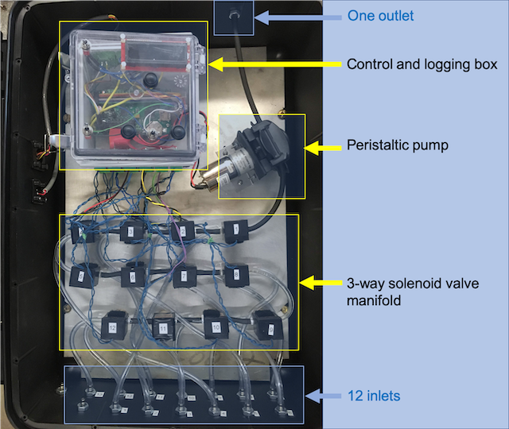

--- 
title: "User Guide for the MUX"
author: "MultiplexÔ"
date: "`r Sys.Date()`"
site: bookdown::bookdown_site
output: bookdown::gitbook
documentclass: book
bibliography: [book.bib, packages.bib]
biblio-style: apalike
link-citations: yes
github-repo: rstudio/bookdown-demo
description: "This is a user guide to use the Multiplexed, Multipoint Sampler system called MUX"
---

# Reasons for the MUX

The first prototype of the system was built in 2010. The idea was that current water quality sensors are expensive and they are designed to be installed to obtain high frequency data at a particular station. In the field of hydrology, agrohydrology, ecohydrology, and limnology, to only name a few, there is a tight coupling between concentration variations in time and those in space. In other words, concentrations may vary by several folds within minutes and meters. To be able to track constituents and their fate over short distances (~< 50 m), one would ideally need not *__one__* but *__several__* sensors... But then the price of such monitoring system would be prohibitive in the vast majority of cases. Not to mention that maintenance and chances of failure would be multiplied by the number of sensors deployed.

A more promising idea was to create a system that would be able to provide access to high enough frequency data for *__multiple points__* in the vicinity of *__one sensor__*. This solves the affordability problem as one sensor only is necessary, and it also solves the problem of multiplying maintenance on multiple sensors. Our solution is the MultiPlexed, MultiPoint Sampler or MPS, which we have now decided to call the *MUX*, because it is just easier to say! And since you have the instrument with you now, you probably already have a pretty good idea of how it works. 


```{r MUXLayout, echo=FALSE, out.width = '80%', fig.align = 'center', fig.cap="General Layout of the MUX, including a control box, a peristaltic pump, 12 3-way solenoid valves, 12 inlets, and one outlet"}

```

Our solution is thus to bring water to the sensor, rather than the opposite. And once this idea became a promising solution, then expanding the 'bringing of water to the sensor' to multiple points was a natural extension of the idea. All the MUX is, is a peristaltic pump for pumping and purging, a bunch of three-way solenoid valves (we chose 12 for now) that dictate which sampling point is activated, and a micro controller system to control and log all the MUX activities in synchrony with the sensor (Figure \@ref(fig:MUXLayout)). The MUX sequentially pumps water from all the desired point to the sensor, and once all the points have been sampled, the sequence starts over again. 

In theory, it is very simple. In practice, we have discovered that it takes a lot of attention to details to have a system that is robust enough to work over long periods of time reliably. We feel the version we have now is robust enough for others to use, although we are quite aware that there is still room for improvement, and we are dedicated to keep improving our system. We have published the details of the design and the performance of the MUX in -@Birgand2016-to.

## The versions available
Right now, we have three versions available. One specifically dedicated to work with the S::CAN field spectrophotometer called Spectro::lyser, one version that works with any sensor, and, a third version coupled with a synchronous syringe based sampler designed to sample rather small volumes of water at very low pumping rates (~around 1 ml/min).

## Downloads

- Download the [SpectroMUX.pdf here](https://francoisbirgand.github.io/Multiplexo/MUXManual.pdf)

- Download the [epub version here](https://francoisbirgand.github.io/Multiplexo/MUXManual.epub)

